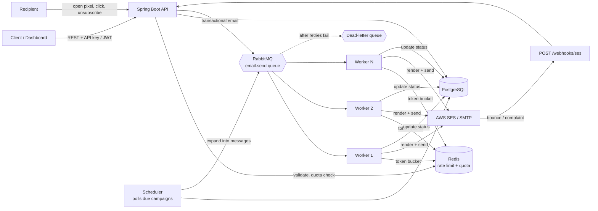
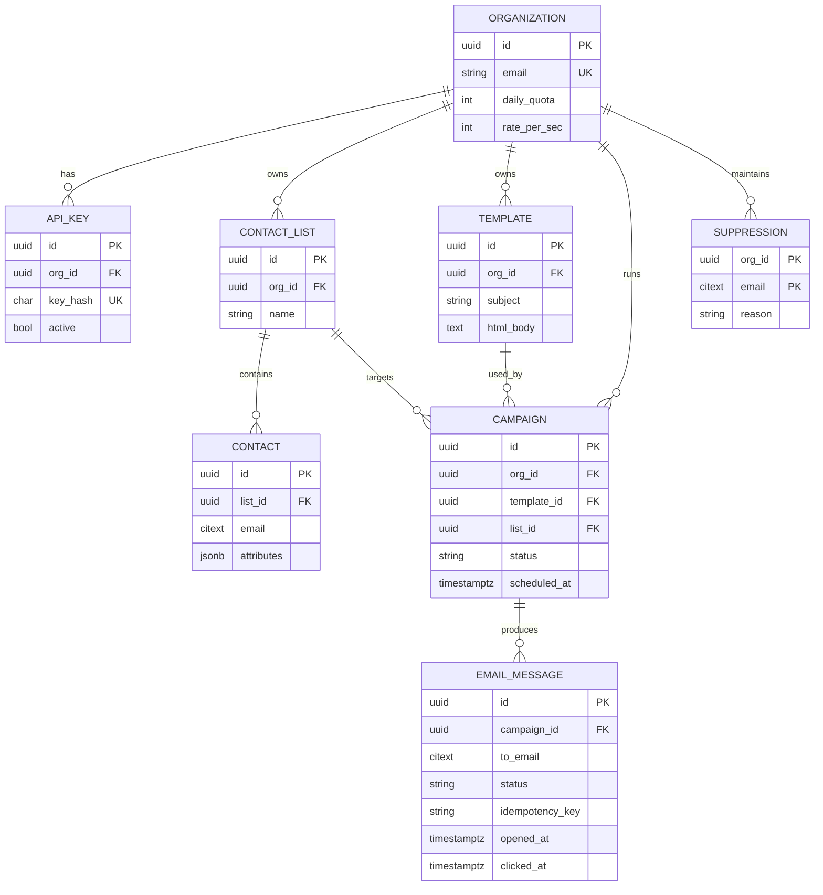
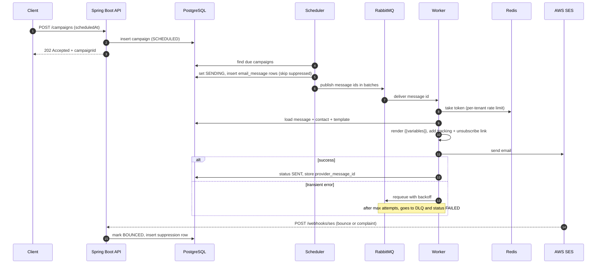
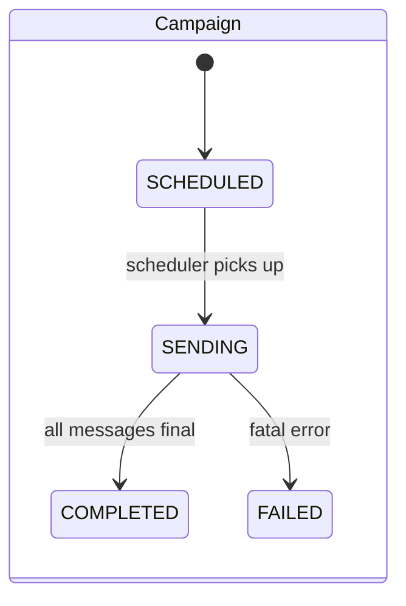
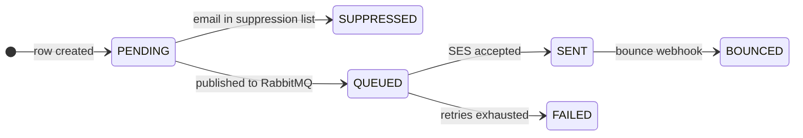

# Bulk Email Service: Diagrams

Mermaid source, so it renders on GitHub. Paste any block into your README.

## 1. System architecture

## 2. Database ER diagram

## 3. Campaign send flow

## 4. Status state machines

